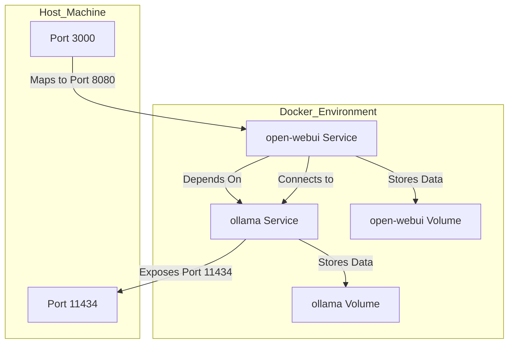

# open-webui-docker

This repository provides a Docker setup for running Open WebUI along with Ollama. The setup uses Docker Compose to manage the services and their dependencies.

## Architecture



## Services

- **open-webui**: The main web UI service
  - Runs on port 3000 (mapped from container port 8080)
  - Depends on ollama service
  - Stores data in a persistent volume
- **ollama**: The backend service required by Open WebUI
  - Provides API endpoints for open-webui
  - Stores model data in a persistent volume

## Prerequisites

- Docker
- Docker Compose
- An OpenAI API key

## Setup

1. Clone the repository:
    ```sh
    git clone https://github.com/yourusername/open-webui-docker.git
    cd open-webui-docker
    ```

2. Create a `.env` file in the root directory and add your OpenAI API key:
    ```sh
    echo "OPENAI_API_KEY=your_openai_api_key" > .env
    ```

3. Start the services using Docker Compose:
    ```sh
    docker-compose up -d
    ```

4. Access the Open WebUI at `http://localhost:3000`.

## Volumes

- `open-webui`: Persistent storage for Open WebUI data.
- `ollama`: Persistent storage for Ollama.

## LinkedIn Post

For more details, you can refer to the [LinkedIn post](https://www.linkedin.com/feed/update/urn:li:activity:7308466117402841088/) about this repository.